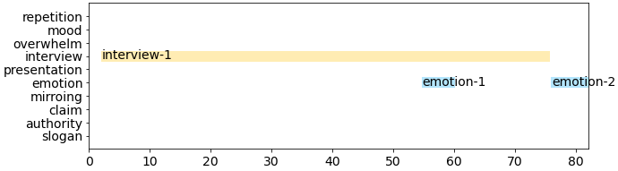

## Example

  <video
    id="my-video"
    class="video-js"
    controls
    preload="auto"
    width="640"
    poster=""
    data-setup="{}"
  >
    <source src="youtube/7hxMeFMMlm8.mp4" type="video/mp4" />
  </video>
  

### A0000000000000

    

#### Comments on each annotation

- **interview-1**: talking about what happened and what the candidate did for her
- **emotion-1**: showing reunion of family
- **emotion-2**: confident and looking straight
