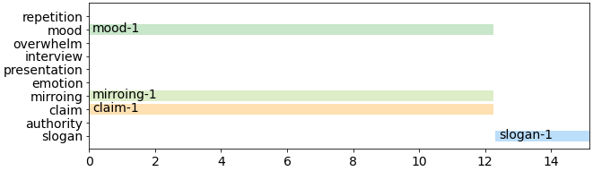

## Example

  <video
    id="my-video"
    class="video-js"
    controls
    preload="auto"
    width="640"
    poster=""
    data-setup="{}"
  >
    <source src="youtube/Tk_znMsa8D8.mp4" type="video/mp4" />
  </video>
  

### A0000000000000

    

#### Comments on each annotation

- **mood-1**: dark, depressing
- **claim-1**: Trump failed
- **slogan-1**: he'll lead
- **mirroing-1**: negative emotion
