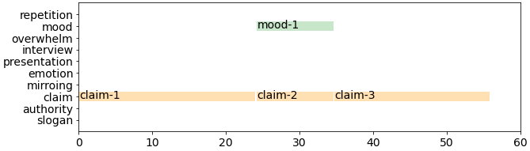

## Example

  <video
    id="my-video"
    class="video-js"
    controls
    preload="auto"
    width="640"
    poster=""
    data-setup="{}"
  >
    <source src="youtube/5dghx1Bjv24.mp4" type="video/mp4" />
  </video>
  

### A0000000000000

    

#### Comments on each annotation

- **claim-1**: claim what Trump brought
- **claim-2**: claim what Biden will do
- **claim-3**: claim what Trump will do
- **mood-1**: dark, greyscale
