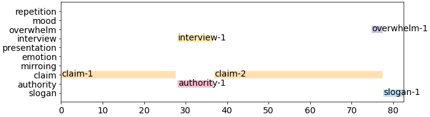

## Example

  <video
    id="my-video"
    class="video-js"
    controls
    preload="auto"
    width="640"
    poster=""
    data-setup="{}"
  >
    <source src="youtube/CNtYb1x6InM.mp4" type="video/mp4" />
  </video>
  

### A0000000000000

    

#### Comments on each annotation

- **claim-1**: claims that Trump is happy with dictators 
- **interview-1**: talking about the brutality
- **authority-1**: perhaps, he is some type of authority
- **claim-2**: claim Trump go along with dictators
- **slogan-1**: end the nightmare
- **overwhelm-1**: shows (perhaps) irrelevant and negative cuts 
