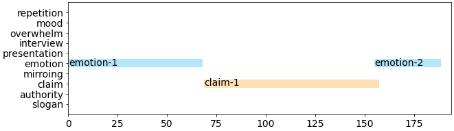

## Example

  <video
    id="my-video"
    class="video-js"
    controls
    preload="auto"
    width="640"
    poster=""
    data-setup="{}"
  >
    <source src="youtube/FnH6yPnJ_0A.mp4" type="video/mp4" />
  </video>
  

### A0000000000000

    

#### Comments on each annotation

- **emotion-1**: hopeful, confident, positive 
- **claim-1**: talking about how Trump is good and down Biden or polliticians
- **emotion-2**: dignity, confidence, greatness
